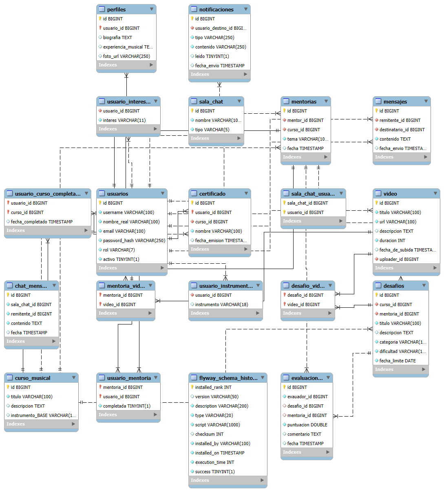

# 🎼 Bach - Plataforma de Desafíos Musicales

**Bach** es una plataforma educativa enfocada en el aprendizaje colaborativo de la música, que permite a los usuarios mejorar sus habilidades musicales a través de desafíos, mentorías, y recursos audiovisuales.

El backend está construido como un monolito utilizando **Java + Spring Boot**, y se comunica con una base de datos relacional **MySQL**, aprovechando entidades y relaciones complejas como videos, usuarios, mentores, cursos y desafíos. Se ha diseñado con una arquitectura clara y escalable, incluyendo DTOs, controladores REST, servicios y repositorios.

---

## 📊 Estructura de Base de Datos



Este diagrama muestra las entidades principales:

* Usuario
* Mentoria
* Video
* Curso
* Desafio
* Notificacion
* Certificado
* Mensajes
* Evaluacion
* Perfil

Relaciones como `@ManyToMany` son gestionadas mediante tablas auxiliares como `desafio_video`, `usuario_mentoria`, entre otras.

---

## ✨ Mejoras en Seguridad y Buenas Prácticas

Este fork del proyecto incluye mejoras clave para el cumplimiento de requisitos de QA, Seguridad y DBA, tales como:

### ✔️ Seguridad

* Autenticación y autorización JWT con roles (ADMIN, MENTOR, USER).
* CORS y CSRF configurados adecuadamente.
* Habilitación de HTTPS con certificado autogenerado y keystore.
* Seguridad de transporte configurada con headers seguros.

### 🔎 Análisis de Vulnerabilidades

* Escaneo automatizado con **OWASP ZAP**.
* Se agregó el archivo de reporte en `reportes/2025-07-06-ZAP-Report-.html`.
* Endpoints públicos protegidos contra acceso no autorizado.

### ⌛ Backups Automatizados

* Script programado con `@Scheduled` para generar respaldo de la base de datos MySQL cada X tiempo.
* Configurable mediante `application.properties` (`backup.dir`).

### ✅ Testing

* Pruebas unitarias con JUnit sobre los endpoints más críticos (consultas, roles, acceso).
* Se consideran pruebas manuales y automáticas documentadas en archivo externo.

---

## 🚀 Arquitectura del Backend (Monolito)

El backend sigue la estructura clásica en capas:

```
├── com.bach.api
│   ├── api
│   │   ├── rests            # Controladores REST
│   │   ├── services         # Servicios y lógica de negocio
│   │   └── types            # DTOs y enums
│   ├── config               # Configuración CORS, JWT, seguridad
|   |   └── security             # Filtros de seguridad y TokenService
│   ├── jpa
│   │   ├── repositories     # Interfaces para acceso a datos
│   │   └── entities         # Entidades JPA (Video, Usuario, etc.)
│   
│   └── Application.java     # Clase principal
```

---

## 🎓 Funcionamiento General

El sistema permite:

* Registro y autenticación de usuarios con token JWT.
* Subida de videos por parte de usuarios para responder a desafíos.
* Asociación de videos a desafíos mediante relaciones `@ManyToMany`.
* Visualización filtrada de videos por desafío o mentoria.
* Sistema de certificación al completar desafíos.
* Notificaciones para usuarios según eventos importantes.
* Chat interno entre mentores y aprendices.

La API está protegida por roles: **ADMIN**, **MENTOR**, **USER**, y algunas rutas están disponibles solo con el token JWT válido.

---

## 📅 Créditos y Aportes

### Francisco Xavier Vera Fabila — *Backend & Líder del Proyecto*

* ✍️ Diseño y estructuración completa del backend.
* 📁 Modelado de la base de datos y relaciones.
* 🛠️ Implementación de los endpoints REST principales.
* 📈 Coordinación general del proyecto.
* ⛨️ Fortalecimiento de la seguridad y configuración HTTPS.
* ♻️ Automatización de respaldos y pruebas unitarias.

**GitHub**: [https://github.com/Morfeo95/](https://github.com/Morfeo95/)
**LinkedIn**: [https://www.linkedin.com/in/francisco-x-vera-/](https://www.linkedin.com/in/francisco-x-vera-/)

---

### Jesús Alonso Fuentes Condega — *Backend*

* 📢 Implementación del sistema de notificaciones.
* 🤝 Colaboración activa en el sistema de chat.

**GitHub**: [https://github.com/AlonsoFuentesGTZ](https://github.com/AlonsoFuentesGTZ)
**LinkedIn**: [https://www.linkedin.com/in/alonso-fuentes-24a887184/](https://www.linkedin.com/in/alonso-fuentes-24a887184/)

---

### John Eduard Vivas Cortés — *Backend*

* 🎓 Desarrollo completo del sistema de certificados.
* 🤝 Participación clave en el sistema de chat.

**GitHub**: \[https://github.com/John-Vivas](https://github.com/John-Vivas)
**LinkedIn**: \[https://www.linkedin.com/in/john-e-vivas](https://www.linkedin.com/in/john-e-vivas)

---

📖 Este README está en construcción. Se irá completando a medida que el proyecto avance. Puedes colaborar con sugerencias o mejoras.
